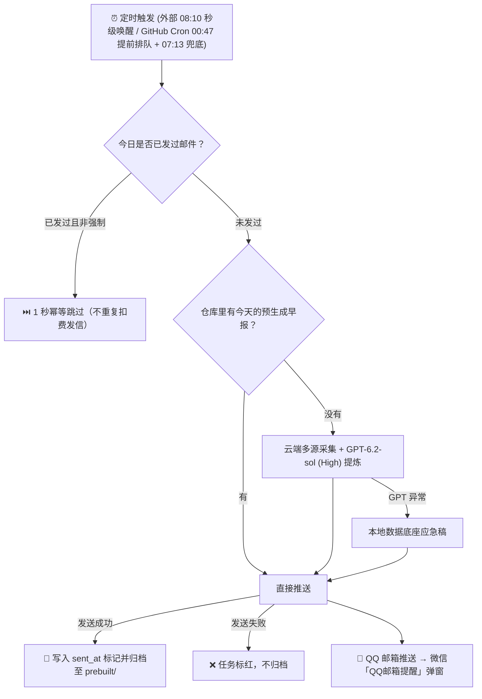

# 🌅 每日 AI & 全球资讯早报 (Daily AI & Global Digest)

> 基于 **GitHub Actions 云端定时生成（GPT-6.2-sol）+ QQ 邮箱推送** 的每日自动化早报系统。每天早上用通俗好懂的大白话把全球要闻、AI 御三家与科技四巨头动态、GitHub 热门实用项目推送到你的邮箱 / 微信「QQ邮箱提醒」。

---

## 🌟 早报内容

1. **🌍 板块一：全球时事**
   - 过去 24 小时最关键的 4~5 条国际政经 / 科技 / 社会热点，直白讲清来龙去脉与实在影响，附来源链接。
2. **🤖 板块二：AI 核心御三家 & 科技四巨头**
   - **🧠 AI 御三家**：OpenAI (GPT / Codex)、Google (Gemini / Antigravity)、Anthropic (Claude)。
   - **⚡ 科技四巨头**：
     - **英伟达 NVIDIA**：AI 芯片、CUDA 生态、黄仁勋动向
     - **特斯拉 Tesla**：FSD、Optimus 机器人、Robotaxi
     - **华为 Huawei**：新品与发布会、麒麟芯片、手机 / 电脑 / 平板 / 耳机 / 手表、鸿蒙系统
     - **苹果 Apple**：新品与发布会、A/M 系列芯片、iPhone / Mac / iPad / AirPods / Watch、iOS / macOS 与 Apple Intelligence
   - 某家当天没有实质新闻时宁缺毋滥，不凑数。
3. **🔥 板块三：GitHub 开源项目寻宝**
   - **📈 今日飙升榜（3 个）**：直接从 GitHub Trending 日榜（不足时自动用周榜补齐）按涨星热度从高到低选拔，不设单一领域茧房，谁真火就讲谁。
   - **🏆 高分口碑榜（2 个）**：从全站 16 个高星维度（数万至十数万 Star、持续维护的口碑名作）按日期轮换翻页挑选。
   - **清爽深度短评（2 短段 + 1 行专属判断）**：不堆砌繁琐的 6~7 栏填表，每个项目基于实时拉取的 README 与 Release 信息，用 **2 个自然大白话短段**讲透用途、亮点、门槛与真实避坑点，并在文末配 **1 行结合 `reader_profile.md` 的「对我有用吗」实话结论**，**30 天内不重复推荐**。

---

## 🏗️ 工作流程


```mermaid
flowchart TD
    B["⏰ 定时触发 (外部 08:10 秒级唤醒 / GitHub Cron 00:47 提前排队 + 07:13 兜底)"] --> I{"今日是否已发过邮件？"}
    I -->|已发过且非强制| S["⏭️ 1 秒幂等跳过（不重复扣费发信）"]
    I -->|未发过| C{"仓库里有今天的预生成早报？"}
    C -->|有| D["直接推送"]
    C -->|没有| E["云端多源采集 + GPT-6.2-sol (High) 提炼"]
    E -->|GPT 异常| F["本地数据底座应急稿"]
    E --> D
    F --> D
    D -->|发送成功| H["💾 写入 sent_at 标记并归档至 prebuilt/"]
    D -->|发送失败| X["❌ 任务标红，不归档"]
    D --> G["📧 QQ 邮箱推送 → 微信「QQ邮箱提醒」弹窗"]
```

---

## 🧠 大模型引擎

| 顺序 | 引擎 | 运行位置 | 所需配置 |
| :--- | :--- | :--- | :--- |
| 1 | **Gemini 4 Hydrogen**（本地 Antigravity 网关，当前停用） | 仅本机 | `LOCAL_LLM_API_KEY`，可选 `LOCAL_LLM_BASE_URL`、`LOCAL_LLM_MODEL` |
| 2 | **GPT-6.2-sol (High)**（`/v1/responses` 协议） | 本机 / 云端主力 | `CODEX_API_KEY` 或 `AIZEX_API_KEY`（双 Key 自动互备） |
| 3 | **本地数据底座应急稿** | 任意 | 无需配置，所有模型都失败时自动启用 |

本机默认优先走推荐香港节点 `ca.memofun.net`，云端 GitHub Actions 默认优先走 CloudFlare 全球节点 `codex-api.aizex.net`，失败时自动互切并支持流式/非流式三级自愈重试。

> 预生成模式下若模型全部失败，不会把应急稿落盘，云端第二天会自己重新生成。

---

## 🛡️ 去重机制

- 每天的早报会记录到 `prebuilt/history_seen.json`（保留 30 天），并同步到 GitHub 仓库，本机和云端共用同一份记录。
- **GitHub 项目**：30 天内推荐过的一律跳过，且完整名单会写进提示词让模型避开。
- **新闻**：7 天内出现过的链接和高度相似的标题会被过滤（有重大新进展除外）。

---

## 🚀 本地运行

### 1. 准备环境
```powershell
cd D:\Codex\Gemini\AI早报
python -m venv .venv
.venv\Scripts\activate
pip install -r requirements.txt
```

### 2. 配置 `.env`
```powershell
copy .env.example .env
```
按 `.env.example` 中的注释填写模型 Key 与邮箱信息。

### 3. 运行方式

| 命令 | 作用 |
| :--- | :--- |
| `python main.py` | 立即生成并推送今天的早报 |
| `python push_prebuilt.py` | 上传最近 3 份预生成早报与去重记录 |
| `python push_prebuilt.py --pull` | 从仓库拉取云端生成的早报与去重记录 |
| `python push_prebuilt.py --code` | 额外把 `main.py`、工作流、`push_prebuilt.py` 同步到仓库 |

> `push_prebuilt.py` 依次从环境变量 `GITHUB_TOKEN`、`.env`、`.gh_token.json` 读取 GitHub Token。

---

## ⚙️ GitHub Actions 配置

仓库：`zjh-fyy/daily-ai-digest`（公开仓库，避免私有仓库定时任务长时间排队）。

在仓库 **Settings → Secrets and variables → Actions** 中添加：

| Secret | 是否必填 | 说明 |
| :--- | :--- | :--- |
| `CODEX_API_KEY` | 必填（与下一项至少一个） | GPT-6.2-sol 的 API Key |
| `AIZEX_API_KEY` | 选填 | 备用 Key |
| `CODEX_BASE_URL` / `AIZEX_BASE_URL` | 选填 | 自定义 API 节点 |
| `CODEX_MODEL` / `CODEX_EFFORT` | 选填 | 默认 `gpt-6.2-sol` / `high` |
| `EMAIL_SENDER` | 必填 | 发件邮箱，如 `xxx@qq.com` |
| `EMAIL_PASSWORD` | 必填 | 邮箱 SMTP 授权码（不是登录密码） |
| `EMAIL_RECEIVER` | 选填 | 收件邮箱，留空发给自己 |
| `SMTP_SERVER` | 选填 | 如 `smtp.qq.com:465`，默认按邮箱后缀自动识别 |
| `READER_PROFILE` | 选填 | `reader_profile.md` 的全文，用于个性化分析 GitHub 项目 |

**准点送达说明**：
- 工作流默认配置了 `cron: '47 16 * * *'`（北京时间 `00:47` 入队，结合 GitHub 实测 5~8.5 小时排队延迟，约早上 `06:00~09:20` 送达）+ `13 23 * * *` 兜底调度，并内置 `sent_at` 幂等防重锁（每天最多只发 1 次，绝不重复扣费或重发）。
- 若需**每天早上 08:10 分秒不差准点送达**（彻底绕开 GitHub `schedule` 排队波动），可在免费服务 [cron-job.org](https://cron-job.org) 或 Cloudflare Workers 中配置每天 `08:10 (Asia/Shanghai)` 发送 `POST https://api.github.com/repos/zjh-fyy/daily-ai-digest/actions/workflows/daily_digest.yml/dispatches`（Body: `{"ref":"main"}`），`workflow_dispatch` 秒级启动，约 `08:14` 准时送达。

手动测试：仓库 **Actions → Daily AI & Global Digest → Run workflow**。

---

## 📧 QQ 邮箱 + 微信提醒设置

1. 登录 [QQ 邮箱网页版](https://mail.qq.com/) → **设置 → 账户**。
2. 开启 **POP3/SMTP 服务**，按提示发短信获得 16 位**授权码**，填入 `EMAIL_PASSWORD`。
3. 手机微信搜索「QQ邮箱提醒」，绑定邮箱并开启提醒，收到早报时微信会弹出通知。

---

## 📄 开源许可证
本项目遵循 MIT License。
